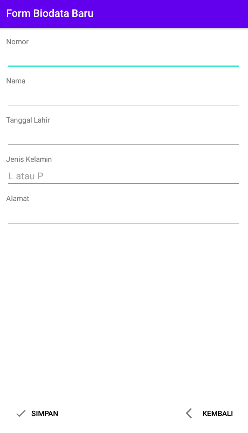

# Nama : E41202420 / Farul Ahmad Wananda
Repositori untuk Workshop Mobile Application | Implementasi SQLite

Preview :

<h3>[1] Menu Utama</h3>

<h3>[2] Lihat Biodata </h3>

<h3>[3] Update Biodata </h3>

<h3>[4] Tambah Biodata </h3>

<h3>[5] Berhasil Update & Tambah Biodata </h3>

